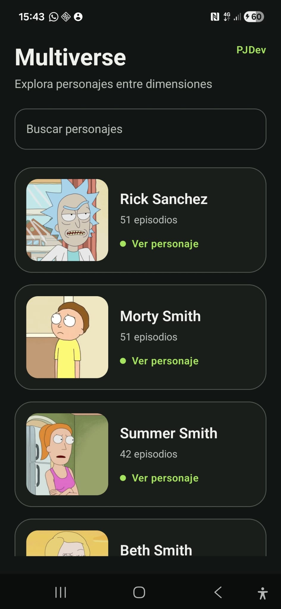
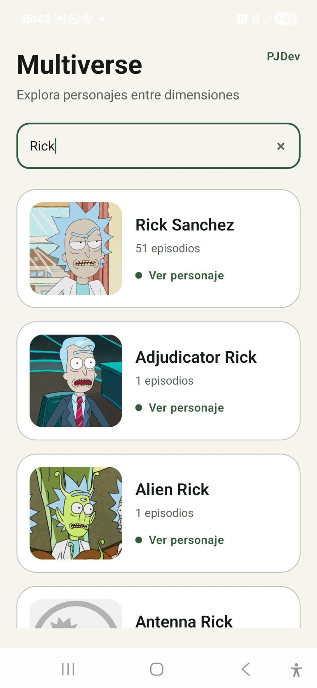
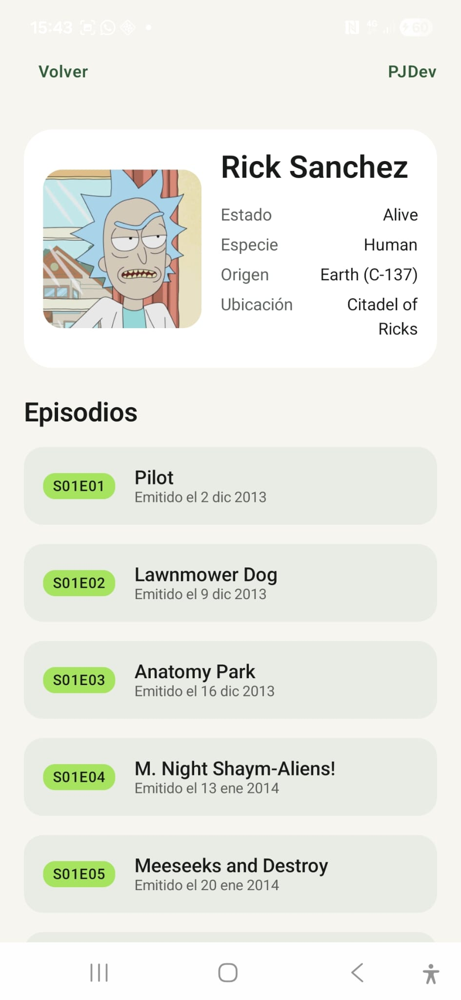

# Multiverse

**Multiverse** is a native Android application developed as part of an Android technical challenge.

The application consumes the **Rick and Morty API** and allows users to explore characters through an infinitely paginated list, search by name and access detailed character and episode information.

The project was developed with a focus on **clean code, separation of responsibilities, maintainability and a professional Android development workflow**.

---

## Screenshots

<p align="center">
  
  
  
</p>

---

## Features

- Infinite character list with **Paging 3**
- Character search
- Character detail screen
- Episode information
- Light and dark themes
- English and Spanish localization
- Loading, empty and error states
- Retry support for network failures
- HTTP 429 rate-limit handling
- Image loading with fallback states
- Accessibility support with Compose semantics
- Scroll-to-top interaction
- Splash screen and adaptive launcher icon

---

## Tech Stack

- **Kotlin**
- **Jetpack Compose**
- **Material 3**
- **MVVM**
- **Clean Architecture**
- **Coroutines & Flow**
- **Paging 3**
- **Retrofit**
- **OkHttp**
- **Kotlin Serialization**
- **Hilt**
- **Coil 3**
- **Navigation Compose**
- **JUnit**
- **JaCoCo**
- **Detekt**
- **Android Lint**
- **GitHub Actions**

---

## Architecture

The project is divided into four Gradle modules:

```text
app
presentation
domain
data
```

The objective is to keep UI, business logic and data access clearly separated.

The `domain` module remains independent from Android-specific implementations, while the `app` module connects the different parts of the application through dependency injection.

---

## Implementation Highlights

### Pagination

The character list uses **Paging 3** to progressively retrieve API results instead of loading the complete dataset at once.

Paging manages additional page loading, refresh states and retry behaviour while integrating directly with Compose's `LazyColumn`.

### Search

Character search is implemented using **Kotlin Flow**.

A small debounce prevents unnecessary network requests while the user is typing, and every new query replaces the previous paging stream.

The UI also handles loading, empty and error states when searches change.

### Error Handling

Network errors are converted into application-level states before reaching the UI.

The application handles:

- Network connection failures
- Character not found
- Server errors
- API rate limiting
- Unknown failures

HTTP `429 Too Many Requests` responses include a bounded automatic retry before displaying a recoverable error to the user.

### Character Details

Navigation passes only the selected character ID.

The detail screen retrieves the information it needs through its own ViewModel rather than passing complete objects between destinations.

Episode information is retrieved using the API bulk endpoint when possible to reduce unnecessary requests.

### Image Loading

Images are loaded using **Coil 3**.

While an image is loading, or when loading fails, the UI displays a lightweight fallback instead of leaving an empty space.

### Accessibility

Compose semantics are used to improve compatibility with Android accessibility services such as **TalkBack**.

The implementation includes:

- Screen headings
- Accessible character cards
- Decorative images excluded from duplicated announcements
- Decorative placeholders excluded from TalkBack navigation

Accessibility behaviour was also manually verified using TalkBack.

---

## Code Quality

The project includes several quality checks:

- Unit tests for ViewModels, use cases, repositories, Paging and data mapping
- Code coverage reports with JaCoCo
- Static Kotlin analysis with Detekt
- Android Lint
- R8 and resource shrinking for release builds
- GitHub Actions continuous integration

The CI workflow validates:

```text
Build
Detekt
Lint
Unit tests
```

The same checks can be executed locally with:

```bash
./gradlew assembleDebug detekt lint testDebugUnitTest :domain:test
```

---

## Development Workflow

Development was carried out using separate branches and Pull Requests instead of working directly on the main branch.

The workflow includes:

```text
main
develop
feature/*
fix/*
```

This keeps features, fixes and final integration separated and reviewable.

---

## Running the Project

Clone the repository:

```bash
git clone https://github.com/PolJansaDeveloper/PJDevMultiverseApp.git
```

Build the debug application:

```bash
./gradlew assembleDebug
```

On Windows PowerShell:

```powershell
.\gradlew assembleDebug
```

No API key is required.

---

## Project Configuration

- **Min SDK:** 26
- **Target SDK:** 36
- **Compile SDK:** 37
- **Version:** 1.0

---

## Author

**Pol Jansà — PJDev**

Android Developer
