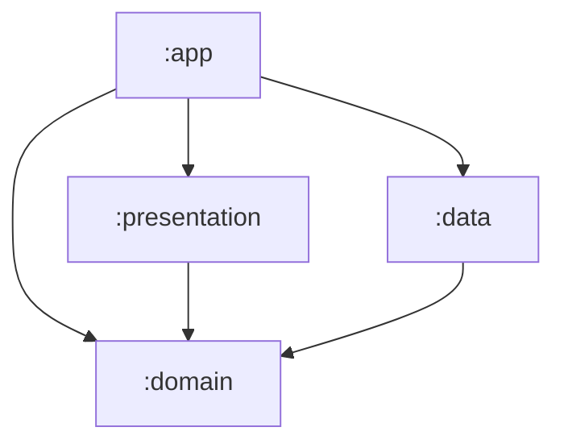

# Multiverse

**Multiverse** is a native Android application developed as part of an Android technical challenge.

The app consumes the public **Rick and Morty API** and allows users to explore characters through an infinitely paginated list, search by name, and access detailed character and episode information.

The project was built with a strong focus on **Clean Architecture, offline resilience, testability, accessibility, code quality and maintainability**.

---

## Screenshots

<p align="center">
  
  
  
</p>

---

## Features

- Infinite character pagination with **Paging 3**
- Offline-first character list backed by **Room**
- Network synchronization with **RemoteMediator**
- Character search with debounced **Kotlin Flow**
- Character detail screen
- Episode information with local persistence
- Cache freshness strategy
- Light and dark themes
- English and Spanish localization
- Type-safe Compose Navigation
- Loading, empty and recoverable error states
- HTTP 429 rate-limit handling
- Offline fallback when cached data is available
- Image loading with fallback states
- Accessibility support with Compose semantics
- Large font / font scaling support
- Scroll-to-top interaction
- Splash screen and adaptive launcher icon

---

## Tech Stack

| Area | Technology |
|---|---|
| Language | Kotlin |
| UI | Jetpack Compose |
| Design | Material 3 |
| Architecture | Clean Architecture + MVVM |
| Async | Coroutines, Flow, StateFlow |
| Pagination | Paging 3 |
| Local persistence | Room |
| Networking | Retrofit 3 + OkHttp |
| Serialization | Kotlin Serialization |
| Dependency injection | Hilt |
| Images | Coil 3 |
| Navigation | Navigation Compose with type-safe routes |
| Unit testing | JUnit |
| Mocking | MockK |
| Android JVM testing | Robolectric |
| Migration testing | Room MigrationTestHelper |
| Static analysis | Detekt |
| Android analysis | Android Lint |
| Coverage | JaCoCo |
| CI | GitHub Actions |

---

# Architecture

The project follows **Clean Architecture** and is split into four Gradle modules:

```text
:app
:presentation
:domain
:data
```

Their responsibilities are deliberately separated.



### `:domain`

Pure JVM module containing:

- Domain models
- Repository contracts
- Use cases
- Domain-level errors

It has no dependency on Android framework classes or implementation details.

### `:data`

Contains all data implementations:

```text
data/
├── di/
├── repository/
└── source/
    ├── local/
    │   ├── dao/
    │   ├── database/
    │   ├── entity/
    │   └── mapper/
    └── remote/
        ├── api/
        ├── dto/
        ├── error/
        ├── mapper/
        └── paging/
```

Responsibilities include:

- Retrofit API communication
- Room persistence
- Paging 3 `RemoteMediator`
- Remote and local mapping
- Cache management
- Repository implementations
- Infrastructure error mapping

### `:presentation`

Contains:

- Compose screens
- Reusable UI components
- ViewModels
- UI state
- Presentation error mapping
- Application theme
- Accessibility semantics
- Preview tooling

The presentation module depends on domain abstractions rather than data implementations.

### `:app`

Acts as the application entry point and composition root.

It connects the modules through Hilt and contains:

- `Application`
- `MainActivity`
- Dependency injection wiring
- Type-safe navigation graph

---

# Offline-first data strategy

One of the main architectural decisions in the project is that **Room is the source of truth for the character list**.

The UI does not render API responses directly.

```text
Rick and Morty API
        ↓
  RemoteMediator
        ↓
       Room
        ↓
   PagingSource
        ↓
    Repository
        ↓
     ViewModel
        ↓
      Compose
```

`RemoteMediator` synchronizes remote pages into Room while Paging reads the locally persisted data.

This provides several advantages:

- Cached characters remain visible when the network fails.
- Pagination survives temporary connectivity problems.
- Refreshing remote data does not require replacing the UI data source.
- Search results can also be persisted.
- The application has a single source of truth.

---

## Cache freshness

Cached character lists use a **24-hour freshness window**.

When Paging starts:

- No cache → launch remote refresh.
- Fresh cache → display cached data without an unnecessary initial request.
- Stale cache → keep cached data visible while attempting a remote refresh.

A failed refresh does not remove previously cached data.

The freshness timestamp represents the last successful **REFRESH**. Loading additional pages does not artificially extend the cache lifetime.

---

## Cached search results

Search results are also persisted locally.

A dedicated query relation stores:

```text
search query
character ID
position
```

This allows Room to preserve the API ordering independently for each search.

Remote pagination state is persisted separately so Paging can continue loading the correct next page.

---

# Pagination

The character list uses **Paging 3 + RemoteMediator**.

The configuration includes:

- Page size: `20`
- Initial load size: `20`
- Prefetch distance: `5`
- Placeholders disabled

Pagination finishes when the API no longer exposes a next page.

`PREPEND` is not required because the API is consumed from the first page forwards.

The UI separately handles:

- Initial loading
- Refresh errors
- Append loading
- Append errors
- End of pagination

Cached Room content always takes priority over displaying a full-screen remote error.

---

# Search

Character search is driven by **Kotlin Flow**.

The search pipeline:

1. Receives user input.
2. Debounces changes for `350 ms`.
3. Trims the query.
4. Replaces the previous Paging stream when the query changes.
5. Persists results for each normalized search.

An empty query restores the complete character list.

The Rick and Morty API returns HTTP `404` when a filtered search has no results.

Instead of treating this as an application failure, the data layer interprets a filtered `404` as a valid empty search result.

For pagination, an append `404` preserves the already cached results and marks pagination as complete.

---

# Character details

Navigation passes only the selected **character ID**.

The destination does not receive complete domain objects.

The detail ViewModel retrieves its own data through the domain layer:

```text
Character ID
     ↓
Detail ViewModel
     ↓
    Use Case
     ↓
 Repository
     ↓
Room + API
```

When loading a detail:

1. The repository checks for cached character information.
2. It attempts to refresh the detail from the API.
3. Character and episode data are persisted in Room.
4. The final result is read again from Room.
5. If the refresh fails, cached information is returned when available.

Character metadata may already exist because characters are persisted by the list.

Episode details are cached after the detail information has been loaded successfully, so previously loaded episode lists remain available offline.

---

## Episode loading

Episode IDs are extracted from the character response.

The repository optimizes requests depending on the number of episodes:

```text
0 episodes → no episode request
1 episode  → single episode endpoint
2+         → bulk episode endpoint
```

Episode relationships preserve the order declared by the character API rather than relying on the order returned by the bulk endpoint.

The persistence layer also protects against an unexpectedly partial bulk response: relationships are created only for episodes that were actually received and stored.

---

# Room database

Room stores:

- Characters
- Search-query membership
- Episodes
- Character ↔ Episode relationships
- Paging remote keys
- Cache freshness metadata

The current database version is:

```text
Version 3
```

Database schemas are exported to the repository so migrations can be tested.

Implemented migrations include:

### `1 → 2`

Adds cache freshness information to remote paging keys.

### `2 → 3`

Adds explicit episode position information to character-episode relationships.

This ensures episode order is preserved independently from episode IDs.

Migration coverage also verifies the complete:

```text
1 → 3
```

upgrade path.

---

# Error handling

Infrastructure exceptions are prevented from leaking directly into the UI.

Errors are translated through the architecture:

```text
Network / Retrofit / Serialization exception
                ↓
           Data layer
                ↓
        DomainException
                ↓
        Presentation error
                ↓
             UI state
```

The application distinguishes between:

- Network failures
- Resource not found
- Rate limiting
- Server failures
- Unknown failures

---

## HTTP 429 handling

The API may temporarily reject requests with:

```text
429 Too Many Requests
```

When this occurs, the Paging data source performs one bounded retry.

If a valid `Retry-After` header is available, it is respected within a safe delay range.

If the retry still fails, the error is propagated as a recoverable domain error instead of retrying indefinitely.

---

# Type-safe navigation

Navigation uses the type-safe Navigation Compose API rather than manually constructed string routes.

Destinations are represented by serializable types:

```kotlin
@Serializable
data object CharacterListDestination

@Serializable
data class CharacterDetailDestination(
    val characterId: Int,
)
```

The selected ID is retrieved with `toRoute()`.

This removes:

- Manually constructed route strings
- String argument keys
- Manual `NavType` declarations
- Manual argument extraction

and gives navigation arguments compile-time structure.

---

# Accessibility and UI quality

Accessibility was considered as part of the UI implementation rather than as a separate final layer.

The project includes:

- Semantic screen headings
- Accessible interactive controls
- Decorative content removed from the accessibility tree where appropriate
- Meaningful episode announcements
- Accessible search clearing action
- Polite live regions for dynamic loading, empty and error states
- Material components with appropriate touch targets
- Responsive layouts for increased font sizes

Character images are decorative because the same character name is already exposed as text, preventing duplicated announcements.

Episode cards are represented as a single logical accessibility element containing their relevant information.

---

## Font scaling

The character detail layout adapts when the device uses a larger font scale.

Instead of forcing all metadata into a compressed horizontal layout, the content can reflow vertically.

Dedicated Compose multipreviews cover:

```text
150% font scale
200% font scale
```

This makes large-text regressions visible directly from Android Studio previews.

---

## Compose previews

Reusable multipreview annotations are used instead of duplicating separate Light and Dark preview functions.

Components can therefore be previewed consistently across themes while still maintaining separate previews when different UI states need to be represented.

Examples include:

- Empty search
- Filled search
- Character cards
- Episode cards
- Character detail header
- Loading states
- Error states

---

# Localization

The application supports:

- English
- Spanish

UI strings are stored in Android resources rather than hardcoded inside composables.

The content returned by the Rick and Morty API remains in the language provided by the API.

---

# Testing strategy

Testing covers multiple architectural layers.

## Domain tests

Use cases are tested independently from Android.

The `:domain` module is a pure JVM module, which keeps domain tests lightweight.

JaCoCo generates HTML and XML coverage reports for the domain test suite.

---

## ViewModel tests

Presentation ViewModels are tested using:

- JUnit
- MockK
- Coroutine test utilities
- Controlled main dispatcher

Coverage includes scenarios such as:

- Initial state
- Successful loading
- Failure states
- Retry behaviour
- Search changes
- Search debounce
- Blank search reset

Repositories are mocked using MockK rather than custom test repository implementations.

---

## Repository tests

`CharacterRepositoryImpl` is tested with:

- MockK for the remote API
- A real in-memory Room database
- Robolectric

This allows repository behaviour to be tested against actual Room persistence instead of mocking the database layer.

Coverage includes:

- Character persistence
- Single episode persistence
- Bulk episode ordering
- Partial episode responses
- Offline cache fallback
- Network failure without cache

---

## RemoteMediator tests

`CharacterRemoteMediator` is tested using a mocked API and an in-memory Room database.

Coverage includes:

- Empty cache initialization
- Fresh cache initialization
- Stale cache initialization
- Refresh persistence
- Append pagination
- Refresh timestamp preservation
- Failed refresh with cached data
- Search `404`
- Append `404`

---

## Room migration tests

Database migrations use Android instrumented tests with Room's `MigrationTestHelper`.

The tested paths include:

```text
1 → 2
2 → 3
1 → 3
```

These tests verify that existing data survives schema evolution.

They can be run on a connected emulator/device with:

```bash
./gradlew :data:connectedDebugAndroidTest
```

Windows PowerShell:

```powershell
.\gradlew :data:connectedDebugAndroidTest
```

---

# Code quality

The project uses several automated quality controls.

### Detekt

Static Kotlin analysis is enabled across the project.

```bash
./gradlew detekt
```

### Android Lint

Android-specific static analysis runs with:

```bash
./gradlew lint
```

### Unit tests

```bash
./gradlew testDebugUnitTest :domain:test
```

### Debug build

```bash
./gradlew assembleDebug
```

### Release optimization

Release builds enable:

- R8 code shrinking
- Resource shrinking

---

# Continuous Integration

GitHub Actions automatically performs the main quality checks.

The CI pipeline executes:

```text
Build debug APK
      ↓
Detekt
      ↓
Android Lint
      ↓
Unit tests
```

The workflow therefore validates that code reaching integration branches can:

- Compile successfully
- Pass static analysis
- Pass Android Lint
- Pass unit tests

Instrumented Room migration tests are intentionally kept outside the standard JVM CI job because they require an Android device or emulator.

---

# Local quality gate

Before considering a change ready for review, the complete local quality gate can be executed with:

```bash
./gradlew clean
./gradlew assembleDebug
./gradlew detekt
./gradlew lint
./gradlew testDebugUnitTest :domain:test
```

Windows PowerShell:

```powershell
.\gradlew clean
.\gradlew assembleDebug
.\gradlew detekt
.\gradlew lint
.\gradlew testDebugUnitTest :domain:test
```

With an emulator connected:

```powershell
.\gradlew :data:connectedDebugAndroidTest
```

---

# Project structure

A simplified view of the repository:

```text
PJDevMultiverseApp/
│
├── app/
│   └── src/main/
│       └── java/com/pjdev/pjdevmultiverseapp/
│           ├── di/
│           ├── navigation/
│           ├── MainActivity.kt
│           └── MultiverseApplication.kt
│
├── presentation/
│   └── src/
│       ├── main/
│       │   └── java/com/pjdev/presentation/
│       │       ├── characterlist/
│       │       ├── characterdetail/
│       │       ├── common/
│       │       └── theme/
│       └── test/
│
├── domain/
│   └── src/
│       ├── main/
│       │   └── java/com/pjdev/domain/
│       │       ├── error/
│       │       ├── model/
│       │       ├── repository/
│       │       └── usecase/
│       └── test/
│
├── data/
│   ├── schemas/
│   └── src/
│       ├── main/
│       │   └── java/com/pjdev/data/
│       │       ├── di/
│       │       ├── repository/
│       │       └── source/
│       │           ├── local/
│       │           │   ├── dao/
│       │           │   ├── database/
│       │           │   ├── entity/
│       │           │   └── mapper/
│       │           └── remote/
│       │               ├── api/
│       │               ├── dto/
│       │               ├── error/
│       │               ├── mapper/
│       │               └── paging/
│       ├── test/
│       └── androidTest/
│
├── docs/
│   └── screenshots/
│
├── config/
│   └── detekt/
│
└── .github/
    └── workflows/
        └── android-ci.yml
```

---

# Running the project

Clone the repository:

```bash
git clone https://github.com/PolJansaDeveloper/PJDevMultiverseApp.git
```

Open the project with Android Studio and allow Gradle to synchronize.

Build the debug application:

```bash
./gradlew assembleDebug
```

Windows PowerShell:

```powershell
.\gradlew assembleDebug
```

No API key or additional credentials are required.

---

# Project configuration

```text
Min SDK:      26
Target SDK:   36
Compile SDK:  37
Version:      1.0
```

The application name displayed to the user is:

```text
Multiverse
```

---

# Development workflow

Development follows a branch-based workflow rather than committing features directly to `main`.

The repository uses branches such as:

```text
main
develop
feature/*
fix/*
```

This keeps implementation work, fixes and integration changes separated and reviewable.

---

# Design decisions and trade-offs

The project intentionally prioritizes a clear and maintainable architecture over unnecessary complexity.

Some relevant decisions:

- **Room is the list source of truth** instead of exposing API responses directly.
- **RemoteMediator** provides network synchronization without coupling the UI to networking.
- **Domain remains Android-independent** to preserve architecture boundaries.
- **Only IDs are passed through navigation** instead of complete objects.
- **Type-safe destinations** replace manually constructed routes.
- **Episode details are persisted when retrieved** rather than preloading the entire API dataset.
- **Cached data remains visible during refresh failures** instead of replacing useful content with an error screen.
- **MockK + real in-memory Room** are used for repository tests so both interaction and persistence behaviour are covered.
- **Room migration tests are explicit** instead of relying on destructive migration.
- **Accessibility and large-font behaviour are part of the UI design**, not post-processing steps.

---

# API

The application uses the public **Rick and Morty API**.

No authentication or API key is required.

---

# Author

**Pol Jansà — PJDev**

Android Developer